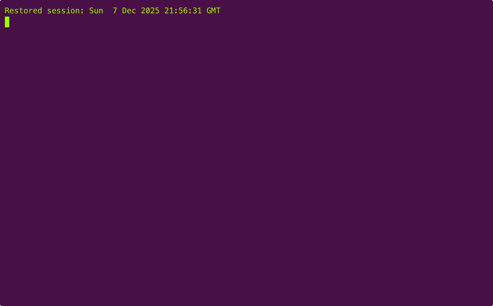
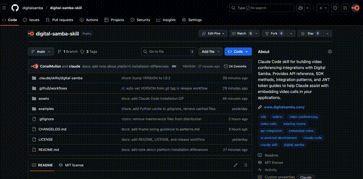

<div align="center">


# Digital Samba Skill for Claude

[](LICENSE)
[](https://docs.anthropic.com/en/docs/claude-code/skills)
[](https://github.com/digitalsamba/digital-samba-skill/releases)

AI-assisted development for embedding white-label video conferencing into your platform.

[Installation](#-installation) • [Usage](#-usage) • [Examples](#-code-examples) • [Resources](#-resources)

</div>

---

## 🤖 What is a Claude Skill?

A **skill** gives Claude domain expertise. It's a set of markdown files that teach Claude about a specific API, SDK, or workflow. When you install this skill, Claude understands Digital Samba's video conferencing platform and can write integration code, explain concepts, and troubleshoot issues—without you having to paste documentation into every conversation.

Works with both **Claude Code** (CLI) and **Claude Desktop**.

> **Note:** Skills install differently on each platform. Claude Code uses project-level folders (`.claude/skills/`), while Claude Desktop uses a ZIP upload via Settings. We provide both methods below.

[Learn more about skills →](https://docs.anthropic.com/en/docs/claude-code/skills)

---

## ✨ What This Skill Does

Building a telehealth app? Online learning platform? Virtual consultation service? This skill helps Claude assist you with integrating Digital Samba's video conferencing into your product.

- 🏠 **Room Management** - Create and configure video rooms via API
- 🔐 **User Authentication** - Generate JWT tokens to securely connect your users
- 📺 **Embedding** - Integrate video calls seamlessly into your UI
- 🎛️ **SDK Control** - Programmatically control the video experience
- 🔔 **Webhooks** - React to room events in your backend

---

## 📦 Installation

### Claude Code (CLI)



**Option A: Git submodule (recommended)** - Enables easy updates via git

```bash
cd your-project
git submodule add https://github.com/digitalsamba/digital-samba-skill.git .claude/skills/digital-samba
```

**Option B: Manual copy**

```bash
git clone https://github.com/digitalsamba/digital-samba-skill.git /tmp/ds-skill
mkdir -p your-project/.claude/skills/digital-samba
cp /tmp/ds-skill/{SKILL,api-reference,sdk-reference,patterns,jwt-tokens}.md /tmp/ds-skill/VERSION your-project/.claude/skills/digital-samba/
```

### Claude Desktop



1. Download `digital-samba.zip` from [Releases](https://github.com/digitalsamba/digital-samba-skill/releases)
2. Open Claude Desktop → Settings → Capabilities → Skills
3. Click "Upload skill" and select the downloaded ZIP

---

## 💬 Usage

Once installed, Claude understands Digital Samba's entire platform. Invoke the skill explicitly for best results:

### Build Complete Features

```
"Using Digital Samba, build a telehealth video consultation system
with a waiting room, recording consent toggle, and post-call summary"

"Use the Digital Samba skill to create a virtual classroom with
breakout rooms for group exercises, a Q&A panel, and attendance tracking"

"Using Digital Samba, add video depositions to my legal platform
with recording, timestamped bookmarks, and transcript export"
```

### Generate Production Code

```
"Use Digital Samba to create a React component that displays
participant video tiles with mute indicators, and lets moderators remove users"

"Using the Digital Samba skill, build a Node.js service that provisions
rooms on-demand, generates secure tokens, and cleans up after 24 hours"

"Use Digital Samba to set up webhook handlers that save recordings
to S3 and email users when their transcript is ready"
```

### Debug & Troubleshoot

```
"Help me debug my Digital Samba JWT tokens - here's my code, what's wrong?"

"Using Digital Samba, why are users joining with the wrong role?"

"My Digital Samba iframe isn't filling its container - how do I fix the CSS?"
```

### Learn the Platform

```
"Using Digital Samba, what's the difference between public and private rooms?"

"Explain how Digital Samba breakout rooms work and show me the API calls"

"Use the Digital Samba skill to help me implement GDPR-compliant recording consent"
```

**Tip:** Start prompts with `"Using Digital Samba..."` or `"Use the Digital Samba skill to..."` for reliable activation.

---

## 📚 Skill Contents

| File | Description |
|------|-------------|
| `SKILL.md` | Quick start guide and overview |
| `api-reference.md` | Complete REST API reference (97 endpoints) |
| `sdk-reference.md` | SDK methods, events, and properties |
| `patterns.md` | Integration patterns + iframe sizing guide |
| `jwt-tokens.md` | Token authentication and user identity |

---

## 💻 Code Examples

The `examples/` directory contains ready-to-use code for common integration scenarios:

### Node.js

| File | Description |
|------|-------------|
| `basic-room.js` | Room provisioning (create, token, list, delete) |
| `webhook-handler.js` | Express server for processing room events |

### React

| File | Description |
|------|-------------|
| `useDigitalSamba.ts` | Custom hook with connection state management |
| `VideoCall.tsx` | Drop-in video call component |

### Python

| File | Description |
|------|-------------|
| `basic_room.py` | Room management with requests + PyJWT |
| `webhook_handler.py` | FastAPI webhook endpoint |

---

## 📋 Requirements

- **Digital Samba Account** - Get your Developer Key from [dashboard.digitalsamba.com](https://dashboard.digitalsamba.com)
- **Claude Code** (CLI) or **Claude Desktop** with project skills enabled

---

## 🔗 Resources

| Resource | Link |
|----------|------|
| REST API Docs | [developer.digitalsamba.com/rest-api](https://developer.digitalsamba.com/rest-api/) |
| SDK on NPM | [@digitalsamba/embedded-sdk](https://www.npmjs.com/package/@digitalsamba/embedded-sdk) |
| Dashboard | [dashboard.digitalsamba.com](https://dashboard.digitalsamba.com) |
| Support | [support.digitalsamba.com](https://support.digitalsamba.com) |

---

## 🔄 Staying Updated

We update this skill when Digital Samba releases new API endpoints or SDK features.

**Check for updates:** Ask Claude *"Is my Digital Samba skill up to date?"* - it knows how to check.

**To update:**

| Install Method | Update Command |
|----------------|----------------|
| **Submodule** | `git submodule update --remote .claude/skills/digital-samba` |
| **Manual copy** | Re-run the install commands above |
| **Claude Desktop** | Download latest ZIP from [Releases](https://github.com/digitalsamba/digital-samba-skill/releases) and re-upload |

**Get notified:** Click "Watch" → "Releases only" on this repo to receive update notifications.

---

## 📄 License

MIT License - see [LICENSE](LICENSE) for details.

---

## 🤝 Contributing

Contributions welcome! Please open an issue or submit a PR.

---

<div align="center">

Built with [Claude Code](https://claude.ai/code)

</div>
